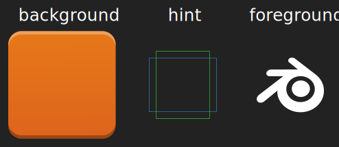
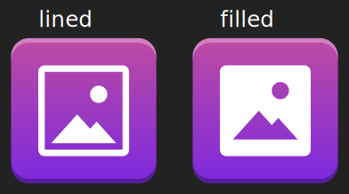

# Setup inkscape
* import the inkscape palette in the Tools folder. how?:
* copy `other/aleta-postre.gpl` to your inkscape folder.
In gnu linux are two possibilities:
	if you have the flatpak version: `~/.var/app/org.inkscape.Inkscape/config/inkscape/palettes`
	if you have the native version: `~/.config/inkscape/palettes`.

# Concepts

here is an image describing the parts of an icon of aleta.

# Filled or not?

there is two designs in aleta. Lined and Filled. Filled is preferred over lined. 

here is the two designs over the same icon:

# Design

* the position of the foreground will fit in the hints.
* the foreground must be white. *This don't mean that you will draw every path in white. you can use any color you want while drawing. this means that the* **result** *of your drawing session is an icon with a white foreground*
* the minimal width is a square of the grid. preferably make «2 squares lines» as minimum.
* if the icon is too complex, try to simplify it.
* please use the **original color**¹; if the original icon shows many colors, decide by yourself what are the best color to use.
* you can use plain colors, but gradients are appreciated.

¹: in aleta postre, i have changed the color rules and now aleta uses the original colors of the apps. there is no more the needing of a palette.

## folder design

* instead of the template.svg, use the template-folder.svg.
* this template is specific for folders and **NOT** FOR ICONS.
* this template hast only one hint.
